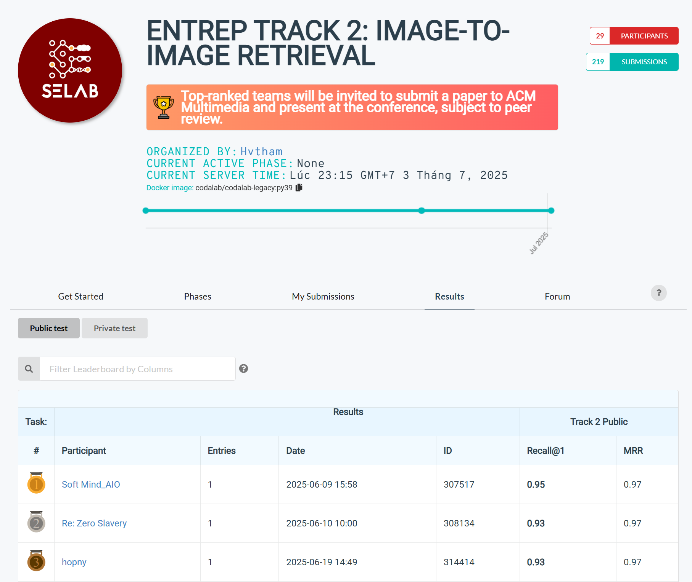

# ENTRep Track 2: Image-to-Image Retrieval

<div align="center">

</div>

This repository contains the training code for ENTRep 2025 Track 2, implementing a Vector Field model with Flow Matching for entity recognition using CLIP embeddings.

## Overview

The model uses:
- **CLIP ViT-B/32** for image embedding extraction
- **Vector Field Model** with Flow Matching for learning time-dependent transformations
- **Triplet Loss** with MultiSimilarityLoss for training
- **Gaussian Fourier Projection** for time encoding
- **Euler Integration** with RK4 method for flow simulation

## Project Structure

```
ENTRep-2025-Track2/
├── models/
│   ├── __init__.py                 # Model package initialization
│   ├── vector_field.py            # Vector Field and Gaussian Fourier Projection models
│   └── rerank_model.py            # Ensemble reranking model for classification
├── utils/
│   ├── __init__.py                 # Utils package initialization
│   ├── common.py                   # Common utilities and shared functions
│   ├── data_processing.py          # Data loading, processing, and triplet generation
│   ├── prediction_utils.py         # Prediction and similarity calculation utilities
│   └── training_utils.py           # Training-specific utilities and helpers
├── notebooks/
│   ├── train.ipynb                 # Original training notebook
│   └── predict.ipynb               # Original prediction notebook
├── assets/
│   └── leader_board.png            # Competition leaderboard image
├── train.py                        # Main training script
├── predict.py                      # Main prediction/inference script
├── requirements.txt                # Python dependencies
└── README.md                       # Project documentation
```

## Installation

1. Install dependencies:
```bash
pip install -r requirements.txt
```

2. Download the dataset:
```bash
# Download using gdown
gdown 1I56vd3aWsy_nkY6zdXk4faIM6NSS5mer
unzip -q data_cifar10_style_public.zip
```

   Or download manually from: https://drive.google.com/uc?id=1I56vd3aWsy_nkY6zdXk4faIM6NSS5mer

## Usage

### Training

Run the training script:
```bash
python train.py
```

The script will:
1. Load and embed images using CLIP
2. Create class mappings and parent-child relationships
3. Generate triplets for training
4. Train the Vector Field model
5. Save the trained model as `vf_model.pth`

### Prediction/Inference

For image-to-image retrieval with reranking:

1. Download required models:
```bash
# Download pretrained Vector Field model
gdown 1KgzoCoaDoFsLYReWHtX-2MdvflrxSGTQ

# Download ensemble reranking model
gdown 1d-JhNGHCKGEIc_9vJYJtHwUPGeShJoOC
unzip -q Rerank_model.zip -d convnextbase-ensemble-metalearner
```

2. Download test dataset:
```bash
# Download private dataset
gdown 1ttmGZdAZJ-4pA9Kz5SMfvff-G_-Xn0uM
unzip -q ./ENTRep_Private_Dataset_Update.zip -d ./ENTRep_Private_Dataset_update/

# Download CSV and related data
gdown 1d66ZMIef0HN8kTfsLzLKlgoAA5NXsI2I
unzip ./ENTRep_Track2_Private_Data.zip
```

3. Run prediction:
```bash
python predict.py
```

The prediction pipeline:
1. Loads CLIP + Vector Field models
2. Loads ensemble reranking models
3. Computes embeddings for all images
4. Performs similarity search with top-5 retrieval
5. Re-ranks results using class predictions
6. Saves results to `rerank003.json`

### Model Architecture

The Vector Field model consists of:
- **Input Normalization**: LayerNorm on input embeddings
- **Time Encoding**: Gaussian Fourier Projection for time `t`
- **Multi-Head MLPs**: 4 independent MLP heads for processing
- **Residual Connections**: Learnable residual scaling for stability

### Training Parameters

- **Embedding Dimension**: 512 (CLIP ViT-B/32)
- **Learning Rate**: 1e-4 with AdamW optimizer
- **Batch Size**: 32
- **Integration Steps**: 10 (Euler with RK4)
- **Early Stopping**: 40 epochs patience
- **Warmup**: 20 epochs

## Dataset

The dataset should be organized in CIFAR-10 style format:
```
data_cifar10_style_public/
├── class1/
│   ├── image1.jpg
│   ├── image2.jpg
│   └── ...
├── class2/
│   ├── image1.jpg
│   └── ...
└── ...
```

### Classes

The model recognizes 7 classes:
- `ear-left` (3)
- `ear-right` (2) 
- `nose-left` (1)
- `nose-right` (0)
- `throat` (6)
- `vc-closed` (4)
- `vc-open` (5)

## Key Features

1. **Hard Negative Mining**: Uses predefined negative class relationships
2. **Parent-Child Relationships**: Finds most similar images within classes
3. **Flow Matching**: Time-dependent vector field learning
4. **Robust Training**: Early stopping, gradient clipping, LR scheduling

## Contributors

- [@thailevann](https://github.com/thailevann)
- [@wterrr](https://github.com/wterrr)
- [@builamquangngoc91](https://github.com/builamquangngoc91)

## Citation

This implementation is based on the ENTRep 2025 Track 2 challenge requirements and uses Flow Matching techniques for embedding transformation learning.
